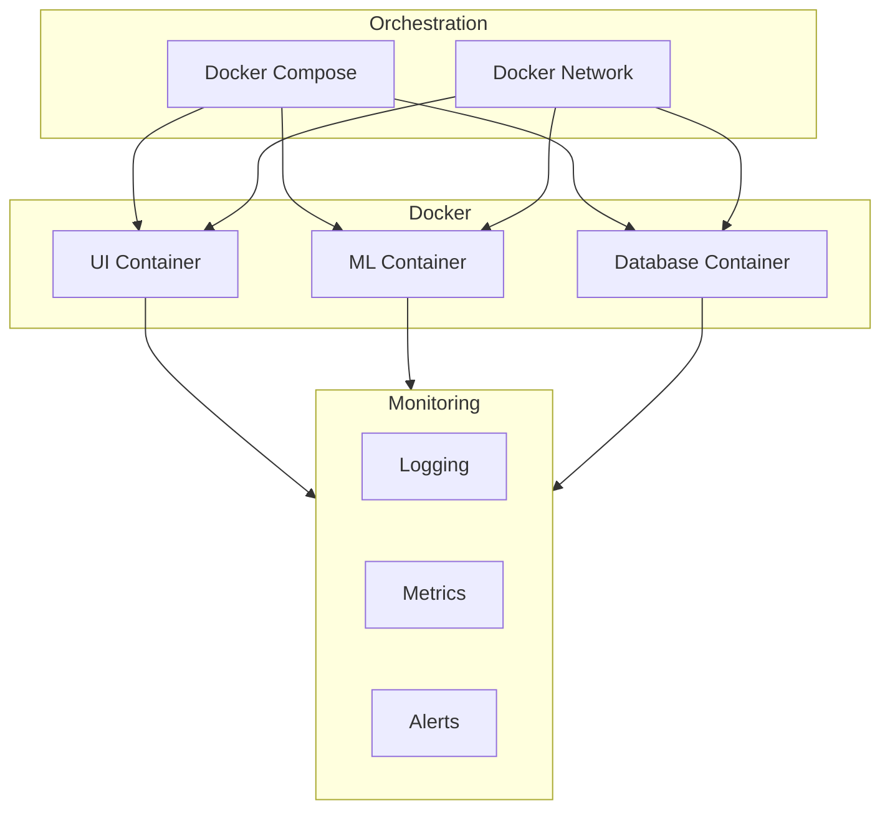

```mermaid
graph TD
    subgraph Docker
        UI[UI Container]
        ML[ML Container]
        DB[Database Container]
    end
    
    subgraph Orchestration
        Compose[Docker Compose]
        Network[Docker Network]
    end
    
    subgraph Monitoring
        Logs[Logging]
        Metrics[Metrics]
        Alert[Alerts]
    end
    
    Compose --> UI
    Compose --> ML
    Compose --> DB
    Network --> UI
    Network --> ML
    Network --> DB
    UI --> Monitoring
    ML --> Monitoring
    DB --> Monitoring
``` 