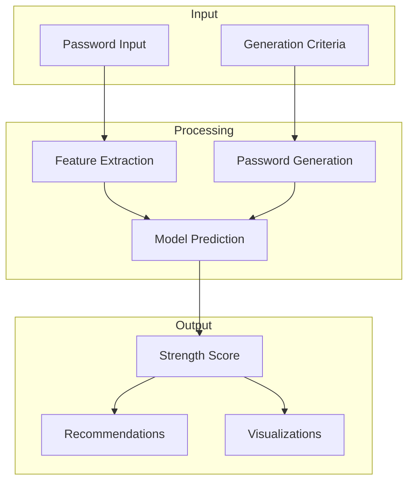

```mermaid
graph TD
    subgraph Input
        P[Password Input]
        C[Generation Criteria]
    end
    
    subgraph Processing
        FE[Feature Extraction]
        ML[Model Prediction]
        PG[Password Generation]
    end
    
    subgraph Output
        S[Strength Score]
        R[Recommendations]
        V[Visualizations]
    end
    
    P --> FE
    C --> PG
    FE --> ML
    PG --> ML
    ML --> S
    S --> R
    S --> V
``` 