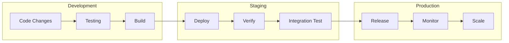

```mermaid
graph LR
    subgraph Development
        Code[Code Changes]
        Test[Testing]
        Build[Build]
    end
    
    subgraph Staging
        Deploy[Deploy]
        Verify[Verify]
        Test2[Integration Test]
    end
    
    subgraph Production
        Release[Release]
        Monitor[Monitor]
        Scale[Scale]
    end
    
    Code --> Test
    Test --> Build
    Build --> Deploy
    Deploy --> Verify
    Verify --> Test2
    Test2 --> Release
    Release --> Monitor
    Monitor --> Scale
``` 