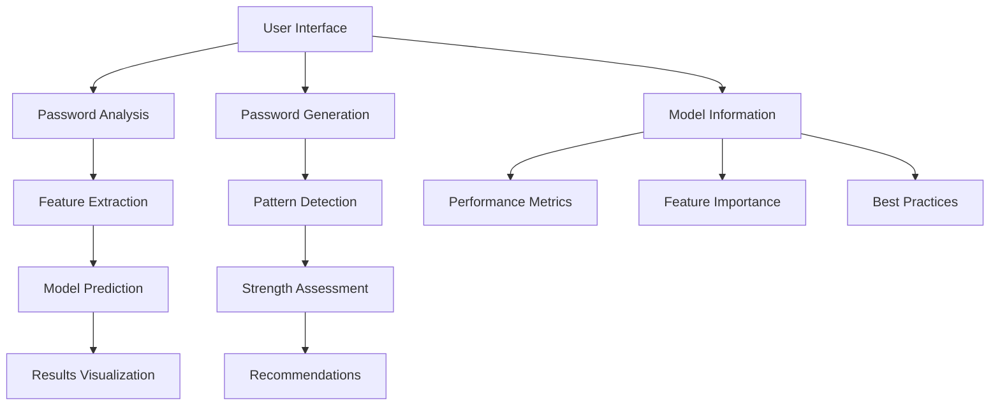

```mermaid
graph TD
    A[User Interface] --> B[Password Analysis]
    A --> C[Password Generation]
    A --> D[Model Information]
    
    B --> E[Feature Extraction]
    E --> F[Model Prediction]
    F --> G[Results Visualization]
    
    C --> H[Pattern Detection]
    H --> I[Strength Assessment]
    I --> J[Recommendations]
    
    D --> K[Performance Metrics]
    D --> L[Feature Importance]
    D --> M[Best Practices]
``` 