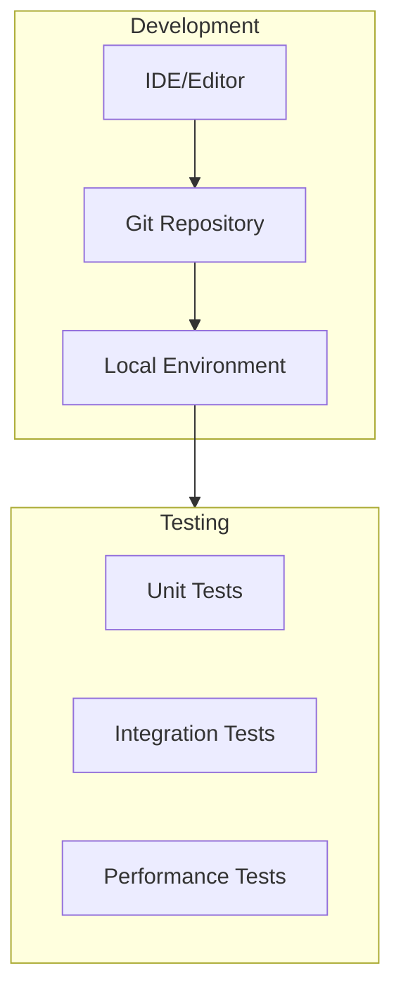

```mermaid
graph TD
    subgraph Development
        IDE[IDE/Editor]
        Git[Git Repository]
        Local[Local Environment]
    end
    
    subgraph Testing
        Unit[Unit Tests]
        Int[Integration Tests]
        Perf[Performance Tests]
    end
    
    IDE --> Git
    Git --> Local
    Local --> Testing
``` 