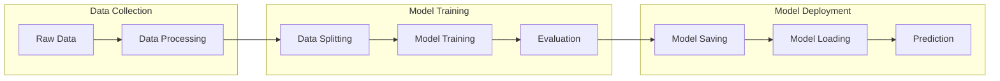

```mermaid
graph LR
    subgraph Data Collection
        Raw[Raw Data]
        Process[Data Processing]
    end
    
    subgraph Model Training
        Split[Data Splitting]
        Train[Model Training]
        Eval[Evaluation]
    end
    
    subgraph Model Deployment
        Save[Model Saving]
        Load[Model Loading]
        Predict[Prediction]
    end
    
    Raw --> Process
    Process --> Split
    Split --> Train
    Train --> Eval
    Eval --> Save
    Save --> Load
    Load --> Predict
``` 