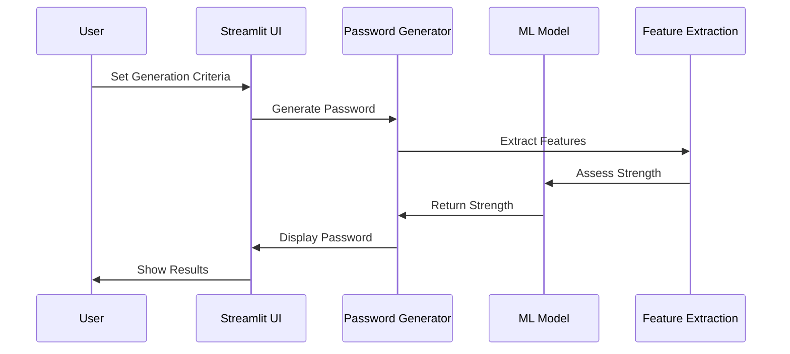

```mermaid
sequenceDiagram
    participant User
    participant UI as Streamlit UI
    participant PG as Password Generator
    participant Model as ML Model
    participant FE as Feature Extraction
    
    User->>UI: Set Generation Criteria
    UI->>PG: Generate Password
    PG->>FE: Extract Features
    FE->>Model: Assess Strength
    Model->>PG: Return Strength
    PG->>UI: Display Password
    UI->>User: Show Results
``` 