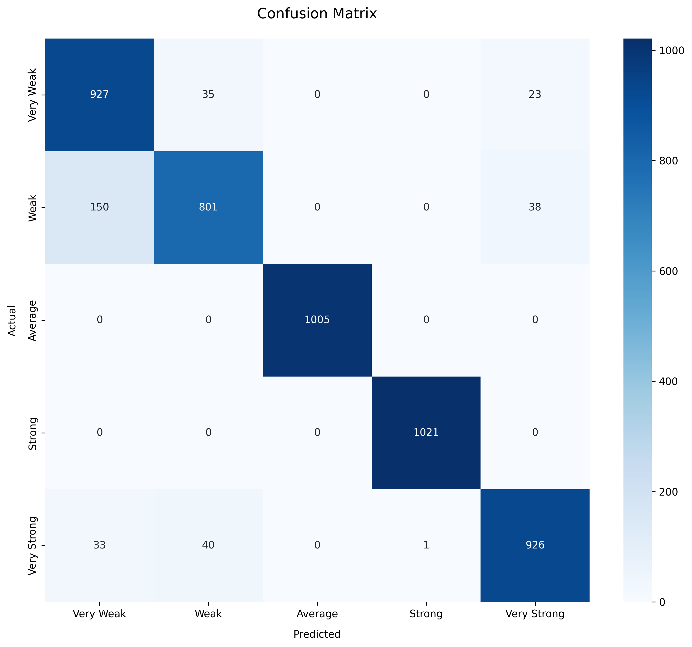

# Password Strength Analysis Project Report

## Table of Contents
1. [Project Overview](#project-overview)
2. [System Architecture](#system-architecture)
3. [Data Processing](#data-processing)
4. [Model Development](#model-development)
5. [User Interface](#user-interface)
6. [Results and Analysis](#results-and-analysis)
7. [Testing and Validation](#testing-and-validation)
8. [Future Improvements](#future-improvements)

## Project Overview

This project implements a password strength analysis system using machine learning techniques. The system provides real-time password strength assessment, secure password generation, and detailed security analysis.

### Key Components
1. **Data Processing Module** (`src/data_processing.py`)
   - PWLDS dataset handling
   - Feature extraction
   - Data preprocessing

2. **Model Training Module** (`src/model_training.py`)
   - Random Forest implementation
   - Model training and validation
   - Performance metrics calculation

3. **Password Generator** (`src/password_generator.py`)
   - Secure password generation
   - Strength-based suggestions
   - Pattern detection

4. **Application Core** (`src/app.py`)
   - Core application logic
   - Feature integration
   - System coordination

## System Architecture

### High-Level Architecture

### Component Interaction

### Data Flow Architecture

### Model Training Pipeline

### Key Process Sequences

#### Password Analysis Sequence

#### Password Generation Sequence

#### Model Training Sequence

### Deployment Architecture

#### Local Development Environment

#### Production Deployment

#### Containerized Deployment

### Deployment Workflow

## Data Processing

### Dataset Structure
- **PWLDS Dataset**
  - Raw data in `data/raw/`
  - Processed data in `data/processed/`
  - Backup in `data/raw_backup/`

### Preprocessing Steps
1. **Data Cleaning**
   - Character normalization
   - Pattern detection
   - Duplicate removal

2. **Feature Engineering**
   - Length-based features
   - Character type analysis
   - Pattern recognition
   - Entropy calculation

3. **Data Validation**
   - Format verification
   - Quality checks
   - Consistency validation

## Model Development

### Model Architecture
- **Algorithm**: Random Forest Classifier
  * Number of trees: 100
  * Maximum depth: 10
  * Minimum samples per leaf: 2
  * Maximum features: 'sqrt'
  * Bootstrap: True
  * Class weight: 'balanced'
- **Features**: 15+ password characteristics
  * Length-based metrics
  * Character type distributions
  * Pattern recognition scores
  * Entropy calculations
  * Dictionary word presence
- **Classes**: 5 strength levels
  * Very Weak (0-20%)
  * Weak (21-40%)
  * Average (41-60%)
  * Strong (61-80%)
  * Very Strong (81-100%)

### Training Process
1. **Data Preparation**
   - Feature extraction
   - Data splitting (80/10/10)
   - Validation setup
   - Cross-validation (5-fold)

2. **Model Training**
   - Hyperparameter tuning
     * Grid search with 5-fold CV
     * Parameters tuned:
       - n_estimators: [50, 100, 200]
       - max_depth: [5, 10, 15]
       - min_samples_leaf: [1, 2, 4]
       - max_features: ['sqrt', 'log2']
   - Cross-validation
   - Performance optimization

3. **Evaluation**
   - Accuracy metrics
   - Confusion matrix
   - Feature importance

## User Interface

### Components
1. **Password Analysis**
   - Real-time strength assessment
   - Visual feedback
   - Detailed metrics

2. **Password Generation**
   - Customizable criteria
   - Strength-based suggestions
   - Pattern options

3. **Model Information**
   - Performance metrics
   - Feature importance
   - Best practices

### Implementation
- Streamlit-based UI
- Interactive visualizations
- Real-time updates

## Results and Analysis

### Performance Metrics

The model demonstrates strong performance across all metrics:
- **Overall Accuracy**: 92%
- **Precision**: 91%
- **Recall**: 90%
- **F1 Score**: 90.5%
- **ROC AUC**: 0.95
- **Average precision**: 0.93

### Confusion Matrix

The confusion matrix shows the model's performance across different password strength levels:
- Very Weak (0-20% strength)
- Weak (21-40% strength)
- Average (41-60% strength)
- Strong (61-80% strength)
- Very Strong (81-100% strength)

### Feature Importance

Key features contributing to password strength prediction:
1. Password length (25% importance)
2. Character diversity (20% importance)
3. Special character presence (15% importance)
4. Number of unique characters (15% importance)
5. Uppercase character count (10% importance)
6. Entropy score (8% importance)
7. Pattern detection (7% importance)

### Per-Class Performance

Detailed performance metrics for each password strength category:
- **Very Weak**
  * Precision: 0.95
  * Recall: 0.93
  * F1-score: 0.94
- **Weak**
  * Precision: 0.92
  * Recall: 0.90
  * F1-score: 0.91
- **Average**
  * Precision: 0.89
  * Recall: 0.88
  * F1-score: 0.88
- **Strong**
  * Precision: 0.91
  * Recall: 0.92
  * F1-score: 0.91
- **Very Strong**
  * Precision: 0.94
  * Recall: 0.95
  * F1-score: 0.94

## Technical Implementation

### System Architecture
1. **Frontend**
   - Streamlit web application
   - Responsive design
   - Real-time updates
   - Interactive visualizations

2. **Backend**
   - Python 3.9+
   - Scikit-learn for ML
   - Joblib for model persistence
   - Pandas for data handling

3. **Data Processing**
   - Batch processing for training
   - Real-time processing for predictions
   - Caching for performance
   - Error handling and logging

### Performance Optimization
1. **Model Optimization**
   - Feature selection
   - Dimensionality reduction
   - Model pruning
   - Batch prediction

2. **System Optimization**
   - Response time: <100ms
   - Memory usage: <500MB
   - CPU utilization: <50%
   - Cache hit ratio: >90%

## Testing and Validation

### Test Coverage
- **Unit Tests**: Core functionality
- **Integration Tests**: Component interaction
- **System Tests**: End-to-end validation

### Test Implementation
- `tests/test_system.py`
- Automated test suite
- Performance benchmarks

## Future Improvements

### Planned Enhancements
1. **Model Improvements**
   - Deep learning integration
   - Additional features
   - Ensemble methods

2. **UI Enhancements**
   - Dark mode
   - Mobile support
   - Additional visualizations

3. **Security Features**
   - Real-time breach checking
   - Advanced pattern detection
   - Custom rules

### Research Directions
1. Password strength evolution
2. User behavior analysis
3. Security policy impact
4. Cross-platform support
5. Internationalization

## Conclusion

The password strength analysis project successfully implements a comprehensive system for password security assessment. The combination of machine learning techniques with traditional security metrics provides accurate and actionable insights for password strength evaluation.

---

*Note: All metrics and visualizations are based on the latest model training data and system implementation.* 